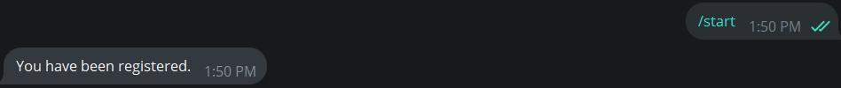
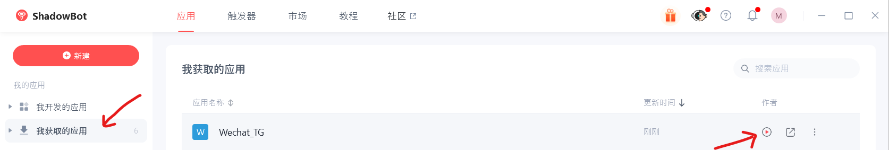

[中文](https://github.com/Maxwellads/telegram-wechat-rpa/blob/main/assets/README-CN.md)
# telegram-wechat-rpa
Feeling tired of WeChat running on your phone and draining your battery? By this tool, you can throw WeChat into work profile and freeze them without missing messages!

# Requirements
- A SPARE Linux/Windows Desktop that you place it running 24/7
- ShadowBot (You can also replace it with alternatives, as all RPA operations can be done easily)
  
# Usage
## Preparations
First, you need to install python3.
```shell
{
sudo apt install python3
sudo apt install python3-pip
}
```
**If you are running on Linux, you might need to install proxychains to use a proxy server, as it's currently glitched and only tested on Windows.**
```shell
sudo apt install proxychains
```
And these python moudles:
```shell
pip install json os logging asyncio aiohttp datetime python-telegram-bot python-telegram-bot[socks] python-telegram-bot[job-queue]
```
*You can also configure a python venv if you like. See: [Python venv](https://docs.python.org/3/library/venv.html)*
## Configuration
Of course you will need to clone and cd to this repo.
```shell
git clone https://github.com/Maxwellads/telegram-wechat-rpa
cd telegram-wechat-rpa
```
To use this bot, you will need to create a bot via @botfather on Telegram and acquire its HTTP API; You will also need your UID by @userinfobot. Once these information are acquired, fill out the config.json with your information like this:
```json
{
  "TOKEN": "MY_BOT_TOKEN",
  "TARGET_UID": "MY_UID",
  "PROXY_URL": "socks5://IP:PORT"
}
```
## How to use
Execute this command: 
```shell
python3 run.py
```
**On the first run, you are required to find your bot and send a /start to it, so that it would be able to send messages to you.**

You can also check the bot's status by sending /status to the bot in chat.

Now you will need to download ShadowBot: [影刀RPA](https://www.yingdao.com/client-download/)
After registing your account, you can acquire this project from here: [Wechat_TG](https://api.winrobot360.com/redirect/robot/share?inviteKey=07ce853e3e7bbf48)

Then click this button to execute the RPA:


# Notes
1. The run.py binds port 10000 to run a HTTP server for communicating with the RPA. Make sure that the port is free to bind, otherwise change the port in run.py. Future versions will allow changing port in config.json.
2. You compyter MUST BE a SPARE one because RPA heavily relies on grahical interface. It is recommended that you disconnect any input hardwares such as keyboard and mouse to prevent unexpected scenarios, and only control you instance by remote desktop.
3. I am NOT a coding guy. The python code was written by ChatGPT 3.5 with me debugging it, if you encounter any problem, feel free to ask.
4. It is always recommended to run this program on a Windows instance, as ShadowBot has poor support on Linux, and run.py does not behave properly when using a proxy.

# Bugs
1. The bot does not connect to proxy servers when running on a Linux environment, instead it would do a direct connection. Cause is unknown. Temp Fix: Use proxychains.
2. The bot might not be working anymore if kept running for a long time. Cause is to be verified. Temp Fix: Restart periodically. 
